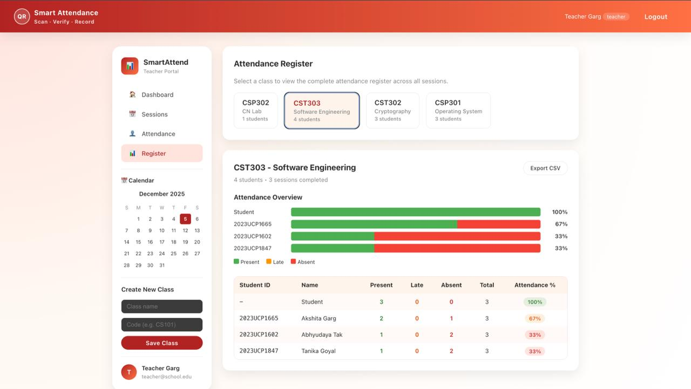
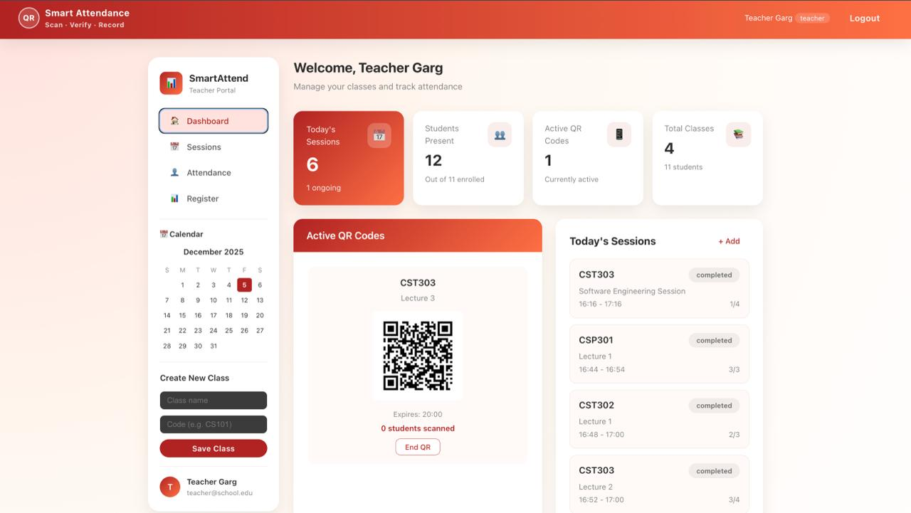

# Smart Attendance System

A web-based attendance management system that uses QR codes for efficient attendance tracking. The system supports three user roles: Students, Teachers, and Administrators.

## Tech Stack

**Frontend:**
- React 19.2.0
- React Router DOM
- Vite
- Axios

**Backend:**
- Node.js
- Express 5.2.1
- MongoDB with Mongoose
- JWT Authentication
- QR Code Generation

## Features

- **QR Code Attendance**: Teachers generate QR codes for sessions; students scan to mark attendance
- **Role-Based Access**: Separate dashboards for Students, Teachers, and Admins
- **Real-Time Updates**: Live attendance tracking with automatic refresh
- **Attendance Reports**: View attendance statistics, registers, and export data to CSV
- **Class Management**: Teachers create classes; students join using class codes
- **Session Management**: Schedule sessions with start/end times

## Installation

1. **Clone the repository**
   ```bash
   git clone <repository-url>
   cd "SE Project"
   ```

2. **Backend Setup**
   ```bash
   cd Se-project/backend
   npm install
   ```

3. **Frontend Setup**
   ```bash
   cd ../frontend
   npm install
   ```

4. **Environment Variables**
   
   Create a `.env` file in the `backend` directory:
   ```
   MONGO_URI=mongodb://127.0.0.1:27017/smart-attendance
   PORT=4000
   JWT_SECRET=your-secret-key
   ```

## Running the Application

1. **Start MongoDB** (if running locally)

2. **Start Backend Server**
   ```bash
   cd Se-project/backend
   npm run dev
   ```
   Server runs on `http://localhost:4000`

3. **Start Frontend Development Server**
   ```bash
   cd Se-project/frontend
   npm run dev
   ```
   Frontend runs on `http://localhost:5173` (or the port shown in terminal)

## Usage

1. **Sign Up**: Students can create accounts with their student ID
2. **Login**: Use email and password to access the system
3. **Teachers**: Create classes, schedule sessions, and generate QR codes
4. **Students**: Join classes, scan QR codes to mark attendance, view attendance history
5. **Admins**: Manage users, view system-wide reports and statistics

## Project Structure

```
SE Project/
├── Se-project/
│   ├── backend/          # Express.js API server
│   │   ├── models/       # MongoDB models
│   │   ├── routes/       # API routes
│   │   ├── middleware/   # Authentication middleware
│   │   └── server.js     # Server entry point
│   └── frontend/         # React application
│       └── src/
│           ├── pages/    # Page components
│           └── components/ # Reusable components
```

## API Endpoints

- `/api/auth/*` - Authentication (login, signup)
- `/api/classes/*` - Class management
- `/api/sessions/*` - Session management
- `/api/attendance/*` - Attendance tracking
- `/api/admin/*` - Administrative functions

## Demo


## License

ISC

